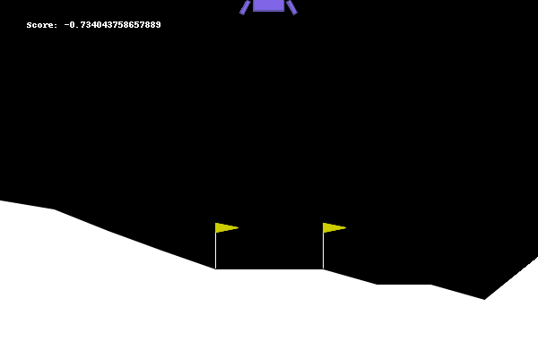

## Reinforcement Learning Package

This package provides an easy way of applying policy gradient into an environment. 
It was designed to work with neural networks from TensorFlow, but one may feel invited to extend to Pytorch models as well. 
There is a class in which the algorithm is parallelized into as many cpus as one may want it. 

We used a reward discount policy using a bit of linear algebra. THe factor depends on the problem and its score dependency on the previous actions. 

Workflow:
    Let the agent explore the environment with the neural network
    every N episodes:
        Apply the reward discount policy in each episode
        Normalize the rewards of the episodes accounting for all of them in the normalization
        Create a weighted average of the gradient using the normalized rewards
        apply the gradient in the NN using the chosen optimizer
        
    Repeat util the number of episodes aimed is reached. 

    

## Results

### Lunar Landing




### Car Racing


## Package Structure. 

Most of the functions inside the Utils package were used as a static method inside the BasePolicyGradient Class (which is encompassed on BasePolicyGradine.py file)
The Test package contains very simples test to check if the class are working well. 

```
PolicyGradient/
|---- Base/
|        |
|        |---__init__.py
|        |---BasePolicyGradine.py
|-----Utils/
|        |
|        |---__init__.py
|        |---UtilsGrads.py
|        |---UtilsRewards.py
|        |---UtilsMetrics.py
|        |---UtilsSaving.py
|-----Tests/
|        |
|        |---__init__.py
|        |---BasePolicyGradient--.py
|        |---PolicyGradientParalel--.py
|        |---PolicyGradientParalel--.py
|
|---PolicyGradient.py
|---PolicyGradientParalel.py

```
